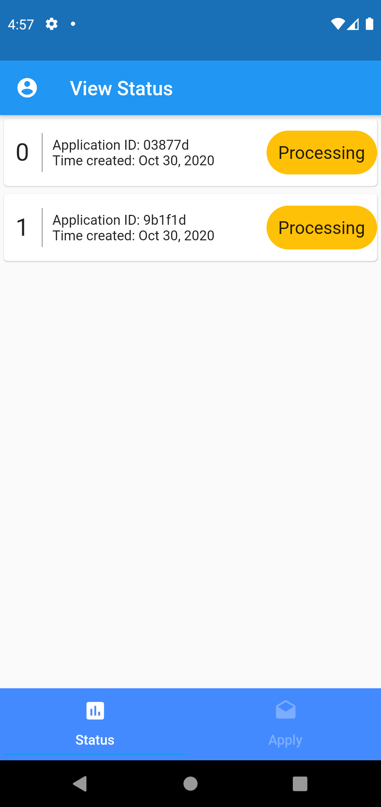

# Orix Local Challenge (Team - The97ers)
Introducing our prototype Flutter apps, here we managed to automate the credit loan application process where commercial customer can easily do loan application and at the mean time lender will be able to see the form submitted in realtime. Besides, we implemented our own AI-driven credit scoring model to predict the loan status in term of score ranging from 0.00 to 1.00 (bad - good). Moreover, we also managed to do face detection and some ID document text recognition (extracting IC number, name and so on) when customers are required to upload their IC copy before applying for a loan in app. 

There will be two separately apps, one for borrower view and another one for lender view.

So far the released version of the apps are currently fully working except the "Add document" functionality as it only works in Android Virtual Device as we tested.

# Screenshots

#Borrower

